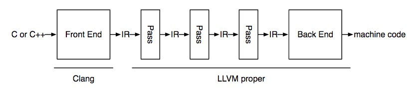

+++
title = "Static Type Checking for Bril"
extra.author = "Yi Jing, Zhijing Li, Neil Adit"
extra.bio = """
[Zhijing Li](https://tissue3.github.io/) is a 2nd year Phd student at ECE department, Cornell. She is interested in compiler optimization and domain-specific languages. \n
[Yi Jiang](http://www.cs.cornell.edu/~yijiang/) is a 2nd year Phd student in CS dept, Cornell. She is interested in designing compilers for Processing-In-Memory related architectures and also general compiler optimization. \n
[Neil Adit](http://www.neiladit.com) is (guess what!) also a 2nd year PhD student at CSL, Cornell. He is interested in fun things in compiler research.

"""
extra.latex = true

+++


## Goal

The goal of the project is to collect run-time information by adding an LLVM pass. We are interested in three kinds of information: 

1. basic execution information including the number of LLVM instructions, basic blocks;
2. expensive instructions information like the number memory operation multiplication and branches since they may largely affect execution time;
3. function information on the number of times each function is called as (why?).


## Design Overview

The LLVM architecture looks like this:




IR represents intermediate language. We only need to add one pass that changes IR to another IR, following instructions to add an LLVM pass in our instructor, [Adrian](<https://www.cs.cornell.edu/~asampson/>)'s [blog post](<https://www.cs.cornell.edu/~asampson/blog/llvm.html>). We also largely relied on github repo [atomicCounter](<https://github.com/pranith/AtomicCounter/blob/master/AtomicCountPass/AtomicCount.cpp>) where it counts the number of an atomic in the IR.

We start from [ModulePass](<http://llvm.org/docs/WritingAnLLVMPass.html#the-modulepass-class>) and then access function inside Module, BasicBlock per function and instruction per Module to obtain all information. At the beginning and ending of each module, we also call custom method `initialize` to create global variables in IR  and `finalize` to print global variables. The structure of our atomic counting pass looks like this:

```c++
  struct SkeletonPass : public ModulePass {
    static char ID;
    SkeletonPass() : ModulePass(ID) {}
      
    virtual bool runOnModule(Module &M); //when there is a Module
    virtual bool runOnFunction(Function &F, Module &M); //called by runOnModule
    virtual bool runOnBasicBlock(BasicBlock &BB, Module &M); // called by runOnFunction
      
    bool initialize(Module &M); //create global variable
    bool finialize(Module &M); //print global variable
      
    void createInstr(BasicBlock &bb, Constant *counter_ptr, int num);
      
    vector<string> atomicCounter; //keep global variable names for profiling. e.g. instr counter
  };
```


## Implementation

### Basic Execution Information

We first create global variable `llvmInstrAtomicCounter` and `basicBlockAtomicCounter` with [GlobalVariable](<https://llvm.org/doxygen/classllvm_1_1GlobalVariable.html#a3ef813d6bda7e49e31cb6bf239c4e264>) constructor.

```c++
new GlobalVariable(M, I64Ty, false, GlobalValue::CommonLinkage, ConstantInt::get(I64Ty, 0), atomicCounter[i]);
```

 Then in each basic block we obtain pointer to the global variable names with [getOrInsertGlobal](<https://llvm.org/doxygen/classllvm_1_1Module.html#abd8f7242df6ecb10f429c4d39403c334>) method. After getting the instruction number in each block, we create atomic addition with [AtomicRMWInst](<https://llvm.org/doxygen/classllvm_1_1AtomicRMWInst.html#abf7e0649c7f272cc49165e579be010a5>) constructor. The complete code looks like this:

```c++

void SkeletonPass::createInstr(BasicBlock &bb, Constant *counter_ptr, int num){
    // create atomic addition instruction
    if(num){
        new AtomicRMWInst(AtomicRMWInst::Add,
                      counter_ptr, // pointer to global variable
                      ConstantInt::get(Type::getInt64Ty(bb.getContext()), num), //create integer with value num
                      AtomicOrdering::SequentiallyConsistent, //operations may not be reordered
                      SyncScope::System, // synchronize to all threads
                      bb.getTerminator());//insert right before block terminator
    }
}

bool SkeletonPass::runOnBasicBlock(BasicBlock &bb, Module &M)
{
    // get the global variable for atomic counter
    Type *I64Ty = Type::getInt64Ty(M.getContext());
    Constant *instrCounter = M.getOrInsertGlobal("llvmInstrAtomicCounter", I64Ty);
    assert(instrCounter && "Could not declare or find llvmInstrAtomicCounter global");
    Constant *bbCounter = M.getOrInsertGlobal("basicBlockAtomicCounter", I64Ty);
    assert(bbCounter && "Could not declare or find basicBlockAtomicCounter global");
    // get instruction number and basic block number.
    int basic_block = 1;
    int instr = bb.size();
    // create atomic addition instruction
    createInstr(bb, bbCounter, basic_block);
    createInstr(bb, instrCounter,instr);
    
    return true;
}

```

Finally, we print the profiling results by first create a function `printf` by specifying input argument and output argument types. Then transverse the `main` function. Right before `return` of the last block in `main`, create string variable corresponding to variables we are tracing and get the pointer to that string variable. Also, get the number variable by first get the pointer pointing to the global variable and then create a load instruction to get the actual pointer to the value. Finally, we can call printf function with input arguments.

```c++
	RBuilder<> Builder(M.getContext());
    Function *mainFunc = M.getFunction("main")
    // not the main module
    if (!mainFunc)
        return false;

    // build printf function handle
    std::vector<Type *> FTyArgs;
    FTyArgs.push_back(Type::getInt8PtrTy(M.getContext())); // specify the first argument, i8* is the return type of CreateGlobalStringPtr
    FunctionType *FTy = FunctionType::get(Type::getInt32Ty(M.getContext()), FTyArgs, true); // create function type with return type, argument types and if const argument 
    FunctionCallee printF = M.getOrInsertFunction("printf", FTy); // create function if not extern or defined
    
    for (auto bb = mainFunc->begin(); bb != mainFunc->end(); bb++) {
        for(auto it = bb->begin(); it != bb->end(); it++) {
            if ((std::string)it->getOpcodeName() == "ret") {
                // insert printf at the end of main function, before return function
                Builder.SetInsertPoint(&*bb, it);
                for(int i = 0; i < atomicCounter.size(); i++){
                    Value *format_long = Builder.CreateGlobalStringPtr(atomicCounter[i]+": %ld\n", "formatLong");// create global string variable formatLong, add suffix(.1/.2/...) if already exists
                    std::vector<Value *> argVec;
                    argVec.push_back(format_long); 
                    Value *atomic_counter = M.getGlobalVariable(atomicCounter[i]);// get pointer pointing to the global variable name
                    Value* finalVal = new LoadInst(atomic_counter, atomic_counter->getName()+".val", &*it);// atomic_counter only points to a string, but we want to print the number the string stores
                    argVec.push_back(finalVal); 
                    CallInst::Create(printF, argVec, "printf", &*it); //create printf function with the return value name called printf (with suffix if already exists)
                }
            }
        }
    }
    return true;
}
```


### Expensive Operations Information

The whole part follows the same flow as basic execution information except we need to distinguish the instruction type and increment corresponding counter on block basis. Therefore in each `runOnBasicBlock` method, we need the following lines:

```c++
	for (auto it = bb.begin(); it != bb.end(); it++) {
        switch (it->getOpcode()) {
            case Instruction::Mul:// multiplication
                mul_instr++;
                continue;
            case Instruction::Br:// branch
                br_instr++;
                continue;
            case Instruction::Store:// store
            case Instruction::Load:// load
                mem_instr++;
                continue;
            default:
                break;
        }
    }
```


## Hardest Parts

1. For people who are new to LLVM, all instructions are hard to find and hard to follow. Searching on google does not help. We cannot search "to create string pointer with llvm" because there are tons of information not related to what we try to do and as invoice, we fundamentally do not know we need to create string pointer for `printf`. Reading document does not help because there are too many functions and LLVM documentation cannot give example for each of them. Without example, we can only vaguely guess what is going on. There are two things that help: reading output IR file and finding tutorial. The former can allow us to observe what is created. However, it does not work when we cannot compile as create functions usually take a lot of inputs and we find it hard to make all of them correct. Luckily, we find a tutorial on [atomic counter](<https://github.com/pranith/AtomicCounter/blob/master/AtomicCountPass/AtomicCount.cpp>) that establishs the general structure for this project.
2. 


## Evaluation and results


